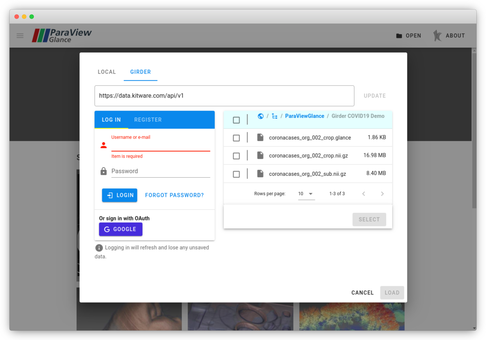

title: Loading Files
----

The most straightfoward way to load files into Glance is to hit the "Open" button on the top-right toolbar, or by typing "Ctrl+O" on the keyboard. To complement different use-cases, there are a few other ways to open files.

## Automatic Remote File Loading via URL

If the data is remote, Glance can automatically load the data upon startup. Glance supports two query parameters: `name` and `url`. When given a name and url, Glance will load the data from `url` and name it as the given `name`. As an example, take the dataset `diskout.vtp`, located at address https://data.kitware.com/api/v1/item/59de9de58d777f31ac641dc5/download. The full URL to load the data at startup is as follows:

```
https://kitware.github.io/glance/app/?name=diskout.vtp&url=https://data.kitware.com/api/v1/item/59de9de58d777f31ac641dc5/download
```

You can try out this link here: [diskout.vtp](https://kitware.github.io/glance/app/?name=diskout.vtp&url=https://data.kitware.com/api/v1/item/59de9de58d777f31ac641dc5/download)

In order to load multiple remote files at once on startup, wrap the query parameters in square brackets like so:

```
https://kitware.github.io/glance/app/?name=[diskout.vtp,cow.vtp]&url=[https://data.kitware.com/api/v1/item/59de9de58d777f31ac641dc5/download,https://data.kitware.com/api/v1/file/5afd936e8d777f15ebe1b4ea/download]
```

You can try out this link here: [diskout.vtp and cow.vtp](https://kitware.github.io/glance/app/?name=[diskout.vtp,cow.vtp]&url=[https://data.kitware.com/api/v1/item/59de9de58d777f31ac641dc5/download,https://data.kitware.com/api/v1/file/5afd936e8d777f15ebe1b4ea/download])

## Loading data from Girder

[Girder](https://girder.readthedocs.io/en/stable/) is an extensible data-management platform designed to store, retrieve, and run tasks on a wide variety of data. Glance supports loading data from Girder, both via remote files via the URL and via a built-in Girder browser. This section will cover the latter, as the former is covered by the section above.



By default, Glance will show a browser for the public Kitware Girder instance, which allows data to be viewed anonymously. By logging in using the form on the left, users may access data stored in protected and private folders. Once data is selected in the right pane, clicking "Select" will tell Glance to download and verify that the data can be loaded.

Other Girder instances may also be used by providing a custom Girder endpoint. Note that the full URL must be the v1 API endpoint, otherwise the Girder browser will not work.

## Export ParaView Scene to Glance

Scenes constructed in ParaView may be exported to a single HTML file that bundles Glance. This way, a ParaView scene may be distributed and users may view the original scene in their web browser. For more information, check out [the blog post that explains this feature](https://blog.kitware.com/exporting-paraview-scenes-to-paraview-glance/).

## Glance State Files

Glance state files are a great way to save your scene and data to either be used later, or for distributing to collaborators and other users. These files store all of the information you need to restore the state of Glance: your data, camera positions, background colors, colormaps, and more. State files can be generated by clicking on "Save State" in the upper right toolbar. This button will generate a `*.glance` file that can then be re-opened in Glance at any time.

When saving Glance state, your data is saved along with the application state. This way, when you send a state file to a collaborator, they too can open the state file and load the previously saved data. However, this means that your state file will be as large as your dataset(s).

For remote files, Glance is smart enough to not save a copy of your dataset in the state file. For instance, if Glance had a remote URL file and a Girder file saved, Glance will automatically recognize that and only save a link to those datasets. That way, the generated state file does not contain a copy of your datasets, keeping the state file small.

If you have Glance state files that are either remote or on Girder, you can load them using the techniques outlined above! Glance will restore with whatever state file you provide, whether it be from some web server or from Girder. This means you can also load Glance state files automatically via the URL, so long as the URL query parameters point to a `*.glance` file. Here is an example that loads `202-t.glance`, one of the samples found on the Glance landing page: [202-t.glance](https://kitware.github.io/glance/app/?name=202-t.glance&url=https://raw.githubusercontent.com/Kitware/glance/master/data/202-t.glance).
